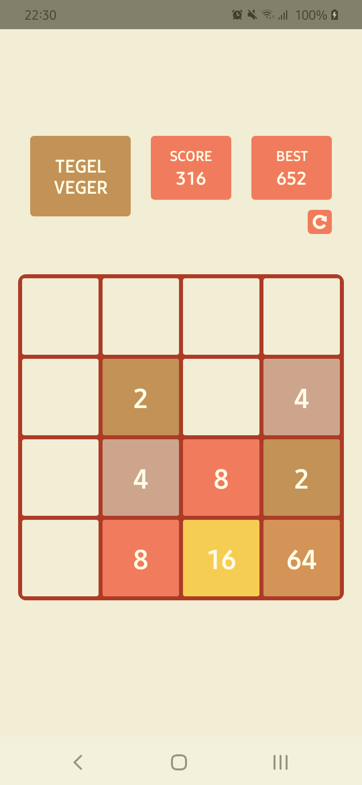

# Tegelveger 

  

(Tegelveger = tile-swiper in Dutch.)

A 2048 clone built in React Native. Merge tiles with the same value by swiping them into eachother and try to reach the 2048 tile!
The application will keep track of your all-time best, and current score and grid layout so you can pause and come back whenever you want to.

Note: The application is developed on an Android and might not work optimally on an iOS device. 

## Why did I build this
I created this app to toy around with React Native's PanResponder and Animated API.

### How to run
#### Locally
1. Clone the repository
2. Run `npm ci` in the root of the project
3. Run `npm run start` to start a packager
4. Run `npm run android` to run the application on a connected device or emulator
